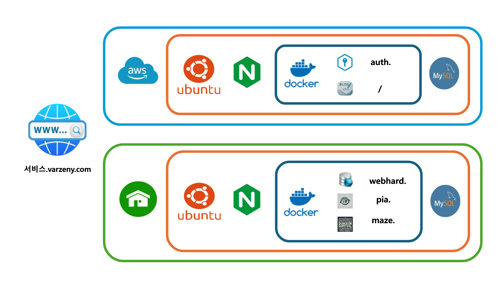

# Personal_Portalsite
개인을 위한 포털사이트

## 개요
> 마이크로 서비스 아케텍쳐의 구현
* 1 단계 : 도메인( varzeny.com ) 세팅
* 2 단계 : 홈 네트워크 포트포워딩 세팅
* 3 단계 : AWS t2.micro 세팅
* 4 단계 : Nginx 리버스 프록시 세팅
* 5 단계 : 서브 도메인들 구현
    1. [중앙인증서버](https://github.com/varzeny/Authorizaion_Server_Py)
    2. [블로그](https://github.com/varzeny/my_blog)
    3. [개인 웹하드](https://github.com/varzeny/Webhard_Server_Py)
    4. [P.I.A](https://github.com/varzeny/pia)
    5. [Maze Survival](https://github.com/varzeny/maze_survival)

## 개발의의
* 내가 개발한 앱들을 상시 피로할 플랫폼 확보
* 종합적인 백앤드 실력 향상

## 구조

## 환경
* 도메인관리 : GoDaddy
* 클라우드 : AWS(t2.micro)
* OS : Ubuntu 24.04, Ubuntu 22.04
* 리버스 프록시 서버 : Nginx
* 격리환경 : Docker
* ASGI서버 : Uvicorn, Daphne
* 웹프레임워크 : Fastapi, Django
* 데이터베이스 : MySQL

## 상태
* 진행 : 5 단계
* 기간 : 2024.06.01-
* 인원 : 1명 
    * [varzeny(최화)](https://varzeny.com/aboutme)
        * 담당 : 전부
        * 기간 : 전부